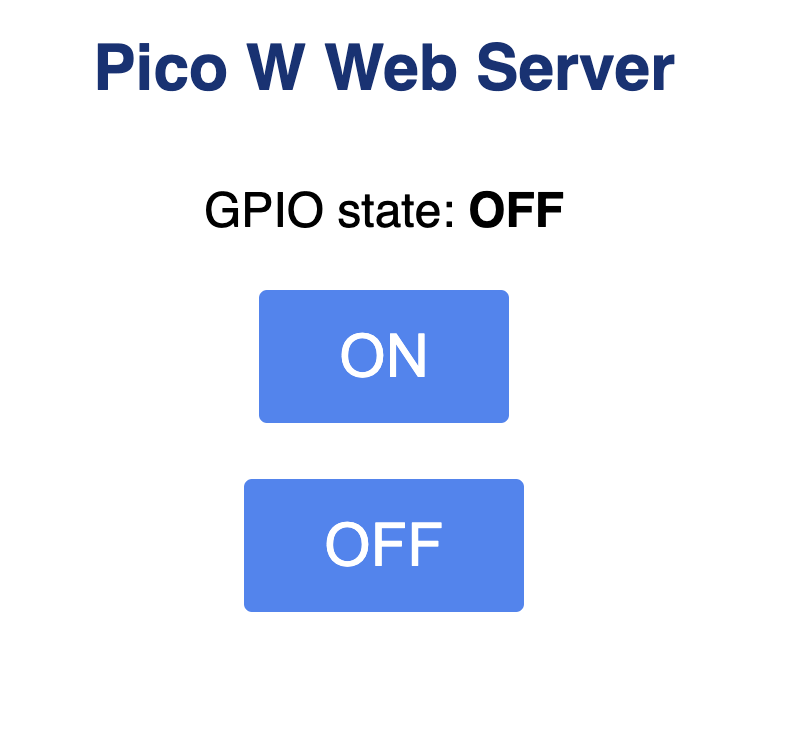

# Raspberry Pi Pico W LED Web Server

This project is a simple web server running on the Raspberry Pi Pico W, allowing you to control an onboard LED via a web interface or terminal commands (using `curl`). The web interface is styled and includes buttons for turning the LED on and off, and it also displays the current status of the LED (ON or OFF).



## Features
- Control the Raspberry Pi Pico W's onboard LED through a web browser.
- Toggle the LED state between ON and OFF.
- Real-time display of the LED status.
- Access the LED status in JSON format via the `/api/led` endpoint.

## How It Works
This web server is built using Python and MicroPython's socket library. The server listens for HTTP requests, and depending on the query parameters, it will either:
- Turn the LED ON (`/?led=on`)
- Turn the LED OFF (`/?led=off`)
- Return the current LED state in JSON format (`/api/led`)

The web page served includes buttons to easily control the LED.

## Hardware Requirements
- **Raspberry Pi Pico W**
- Onboard LED (or an external LED connected to GPIO 25)

## Software Requirements
- **MicroPython** installed on the Raspberry Pi Pico W
- **Thonny** or another MicroPython-compatible IDE

## Setup
1. Clone the repository and upload the files to the Raspberry Pi Pico W using Thonny.
2. Connect the Raspberry Pi Pico W to your Wi-Fi by modifying the `WiFiConnection.py` with your Wi-Fi credentials.
3. Save the `main.py` and supporting files (`WiFiConnection.py`, `LEDControl.py`, `WebServer.py`) to the Pico W.
4. Run the `main.py` file on the Raspberry Pi Pico W.

## Running the Web Server
Once the server is running, open a web browser and go to the Pico W's IP address:

### Example Web Interface:

You should see an interface similar to the one in the image above, with buttons to toggle the LED.

Alternatively, you can control the LED using `curl` from a terminal:

```bash
# Turn the LED on
curl http://<PICO-W-IP-ADDRESS>/?led=on

# Turn the LED off
curl http://<PICO-W-IP-ADDRESS>/?led=off

# Get the LED status in JSON format
curl http://<PICO-W-IP-ADDRESS>/api/led